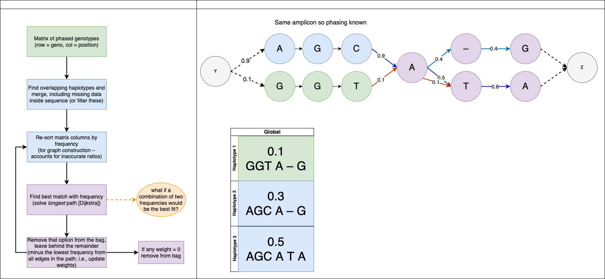

# Hasan

# bacterialPopulationReconstruction

Some of the worst code I've ever written, but the results table is what I intended. The graphs arent great and the code really is terrible.

This takes in two files, a bam alignment of short read amplicons and a table of the identified mutations and attempts to determine the most probably haplotypes.

# #usage

bash run_haplo.sh "path to bam file" "path to snps file"

### Example snps file (tsv)

| CHROM      | POS | REF | ALT | TYPE |
|------------|-----|-----|-----|------|
| rv0678_500 | 489 | C   | A   | SNP  |
| rv0678_500 | 489 | C   | C   | SNP  |
| rv0678_500 | 874 | T   | C   | SNP  |
| rv0678_500 | 874 | T   | T   | SNP  |
